## 实验目的

搭建Hub and Spoke网络，实现分部1到分部2之间可以通过总部网络实现互通，验证分部之间的流量是如何经过总部内网进行传送的。

## 实验环境

GNS3 2.2.34

## 实验步骤

### 1. 搭建网络拓扑

在GNS3中搭建网络拓扑如下图：

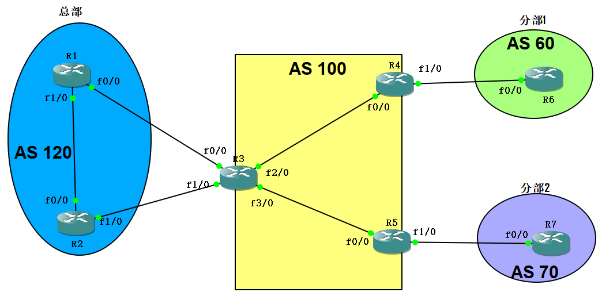

### 2. 接口IP地址配置

使用`config t`命令进入配置模式，然后进行接口IP地址配置

```sh
R1:
int lo0
ip address 1.1.1.1 255.255.255.255
int f0/0
ip address 13.1.1.1 255.255.255.252
no sh
int f1/0
ip address 12.1.1.1 255.255.255.252
no sh

R2:
int lo0
ip address 2.2.2.2 255.255.255.255
int f0/0
ip address 12.1.1.2 255.255.255.252
no sh
int f1/0
ip address 23.1.1.1 255.255.255.252
no sh

R3:
int lo0
ip address 3.3.3.3 255.255.255.255
int f0/0
ip address 13.1.1.2 255.255.255.252
no sh
int f1/0
ip address 23.1.1.2 255.255.255.252
no sh
int f2/0
ip address 34.1.1.1 255.255.255.252
no sh
int f3/0
ip address 35.1.1.1 255.255.255.252
no sh

R4:
int lo0
ip address 4.4.4.4 255.255.255.255
int f0/0
ip address 34.1.1.2 255.255.255.252
no sh
interface f1/0
ip address 46.1.1.1 255.255.255.252
no sh

R5:
int lo0
ip address 5.5.5.5 255.255.255.255
int f0/0
ip address 35.1.1.2 255.255.255.252
no sh
int f1/0
ip address 57.1.1.1 255.255.255.252
no sh

R6:
int lo0
ip address 6.6.6.6 255.255.255.255
int f0/0
ip address 46.1.1.2 255.255.255.252
no sh
 
R7:
int lo0
ip address 7.7.7.7 255.255.255.255
int f0/0
ip address 57.1.1.2 255.255.255.252
no sh
```

配置完成后，可以使用`do show ip int b`命令查看各接口配置是否正确。

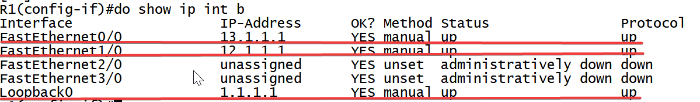

### 3. 域内路由协议配置

此步骤配置AS100域内路由协议

```sh
R3:
router ospf 1
router-id 3.3.3.3
network 3.3.3.3 0.0.0.0 area 0
network 34.1.1.0 0.0.0.3 area 0
network 35.1.1.0 0.0.0.3 area 0

R4:
router ospf 1
router-id 4.4.4.4
network 4.4.4.4 0.0.0.0 area 0
network 34.1.1.0 0.0.0.3 area 0

R5:
router ospf 1
router-id 5.5.5.5
network 5.5.5.5 0.0.0.0 area 0
network 35.1.1.0 0.0.0.3 area 0
```

配置完成后，可以使用下列命令查看OSPF协议是否配置准确，并可使用wireshark抓包分析OSPF协议初始化过程。

```sh
# 查看OSPF邻居
show ip ospf nei

# 查看OSPF链路数据库
show ip ospf data

# 在R3上查看公网路由，是否有到5.5.5.5的路由
show ip route

# 在R3上ping R5，查看路由器之间的可达性
ping 5.5.5.5
```

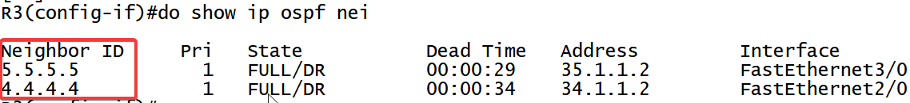

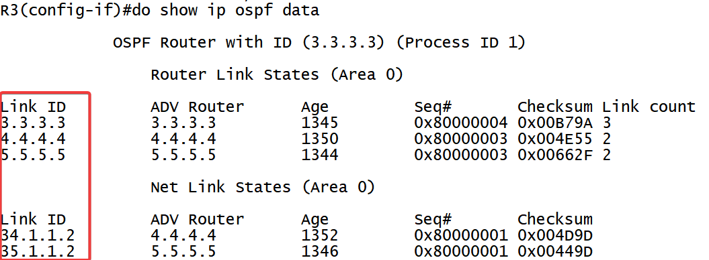

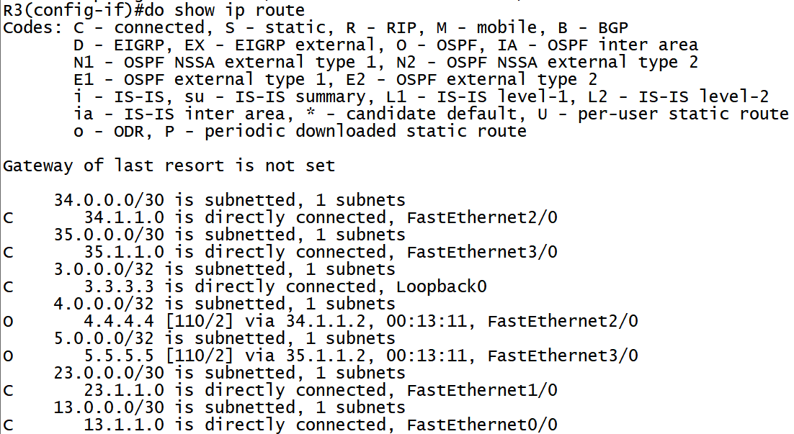

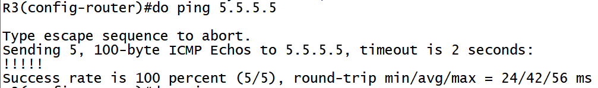

### 4. MPLS协议配置

此步骤将AS100域内路由器对应接口激活MPLS协议

```sh
R3:
ip cef
mpls ldp router-id lo0
mpls label range 300 399
int f2/0
mpls ip
int f3/0
mpls ip

R4:
ip cef
mpls ldp router-id lo0
mpls label range 400 499
int f0/0
mpls ip

R5:
ip cef
mpls ldp router-id lo0
mpls label range 500 599
int f0/0
mpls ip
```

配置完成后，可以使用下列命令查看MPLS协议配置是否正确，并可以使用wireshark查看LDP初始化过程。

```sh
# 查看LDP邻居
show mpls ldp nei

# 查看LIB
show mpls ldp bindings

# 查看RIB
show ip route

# 查看LFIB
show mpls forwarding-table

# 查看FIB
show ip cef

# 在R3上traceroute R5，查看MPLS域内数据封装过程（此步骤课忽略）
traceroute 5.5.5.5
```

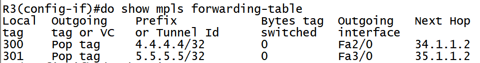

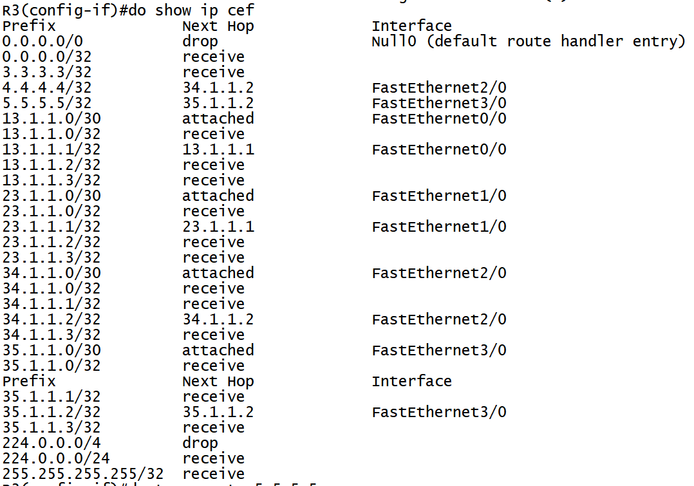

### 5. VPN配置

此处配置R3、R4、R5的VRF。

```sh
R3：
ip vrf import_in
rd 100:11
route-target import 100:67
int f0/0
ip vrf for import_in
ip addr 13.1.1.2 255.255.255.252
ip vrf export_out
rd 100:22
route-target export 100:12
int f1/0
ip vrf for export_out
ip addr 23.1.1.2 255.255.255.252

R4：
ip vrf VPN1
rd 100:6
route-target import 100:12
route-target export 100:67
int f1/0
ip vrf for VPN1
ip addr 46.1.1.1 255.255.255.252

R5：
ip vrf VPN2
rd 100:7
route-target import 100:12
route-target export 100:67
int f1/0
ip vrf for VPN2
ip addr 57.1.1.1 255.255.255.252

```

配置完成后，可以通过下列命令查看VRF配置是否正确

```sh
# 查看私网路由表，确认对应接口路由是否已从公网路由表转移到私网路由表
show ip route vrf import_in

# 查看VRF参数
show ip vrf detail
```

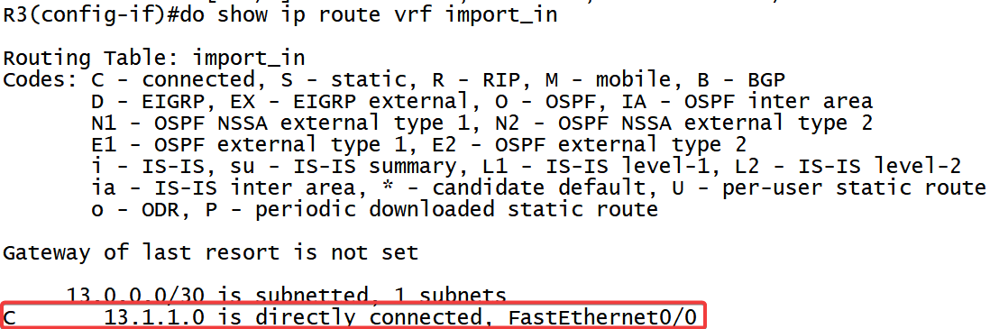

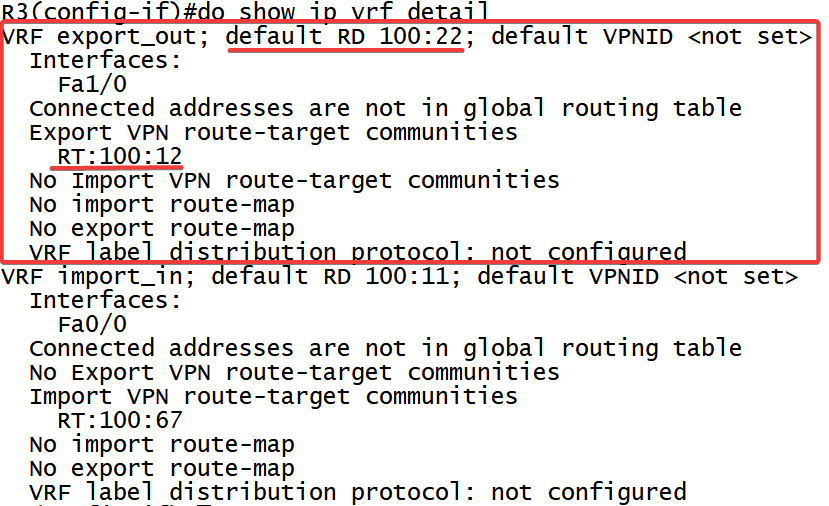

### 6. 配置BGP协议

此步骤配置总部内部路由、总部、分部和MPLS域之间的路由使用BGP协议。

```sh
R1:
router bgp 120
bgp router-id 1.1.1.1
bgp log-neighbor-changes
network 1.1.1.1 mask 255.255.255.255
network 12.1.1.0 mask 255.255.255.252
network 13.1.1.0 mask 255.255.255.252
neighbor 12.1.1.2 remote-as 120
neighbor 12.1.1.2 next-hop-self
neighbor 13.1.1.2 remote-as 100

R2:
router bgp 120
bgp router-id 2.2.2.2
bgp log-neighbor-changes
network 2.2.2.2 mask 255.255.255.255
network 23.1.1.0 mask 255.255.255.252
neighbor 12.1.1.1 remote-as 120
neighbor 12.1.1.1 next-hop-self
neighbor 23.1.1.2 remote-as 100

R3:
router bgp 100
bgp router-id 3.3.3.3
bgp log-neighbor-changes
no bgp default ipv4-unicast
neighbor 4.4.4.4 remote-as 100
neighbor 4.4.4.4 update-source Loopback0
neighbor 5.5.5.5 remote-as 100
neighbor 5.5.5.5 update-source Loopback0
address-family vpnv4
neighbor 4.4.4.4 activate
neighbor 4.4.4.4 send-community extended
neighbor 5.5.5.5 activate
neighbor 5.5.5.5 send-community extended
address-family ipv4 vrf export_out
neighbor 23.1.1.1 remote-as 120
neighbor 23.1.1.1 activate
address-family ipv4 vrf import_in
neighbor 13.1.1.1 remote-as 120
neighbor 13.1.1.1 activate
  
R4:
router bgp 100
bgp router-id 4.4.4.4
bgp log-neighbor-changes
no bgp default ipv4-unicast
neighbor 3.3.3.3 remote-as 100
neighbor 3.3.3.3 update-source Loopback0
address-family vpnv4
neighbor 3.3.3.3 activate
neighbor 3.3.3.3 send-community extended
address-family ipv4 vrf VPN1
neighbor 46.1.1.2 remote-as 60
neighbor 46.1.1.2 activate

R5:
router bgp 100
bgp router-id 5.5.5.5
bgp log-neighbor-changes
no bgp default ipv4-unicast
neighbor 3.3.3.3 remote-as 100
neighbor 3.3.3.3 update-source Loopback0
address-family vpnv4
neighbor 3.3.3.3 activate
neighbor 3.3.3.3 send-community extended
address-family ipv4 vrf VPN2
neighbor 57.1.1.2 remote-as 70
neighbor 57.1.1.2 activate

R6:
router bgp 60
bgp router-id 6.6.6.6
bgp log-neighbor-changes
network 6.6.6.6 mask 255.255.255.255
network 46.1.1.0 mask 255.255.255.252
neighbor 46.1.1.1 remote-as 100
 
R7:
router bgp 70
bgp router-id 7.7.7.7
bgp log-neighbor-changes
network 7.7.7.7 mask 255.255.255.255
network 57.1.1.0 mask 255.255.255.252
neighbor 57.1.1.1 remote-as 100
```


### 7. 验证

- 在R3上查看BGP vpnv4邻居情况

  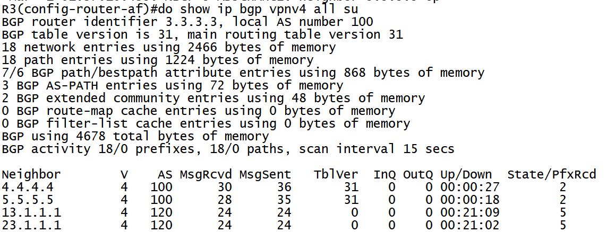

  由此可以看出，其四个邻居建立成功，并且收到相应的路由。

- 在R3上查看vpn信息

  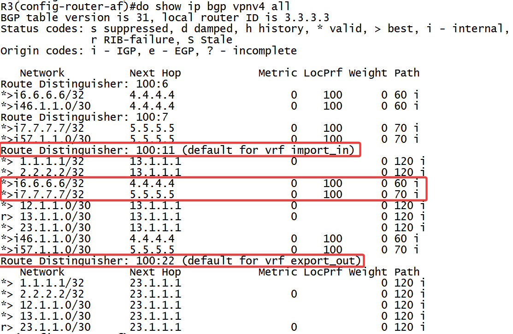

  从以上可知RD为100:11的有import_in 为100:67，而PE-R4及PE-R5的export为100:60、100:70，因此R6和R7的路由加入路由表项中，而RD 为100:22的VRF中，并没有设置import，不能从BGP ×××V4中导入任何路由，因此其收到的路由都是CE-R2通过EBGP传递过来的，其下跳都为23.1.1.1，且其中没有6.6.6.6和7.7.7.7的路由

- 在R2上查看BGP路由情况

  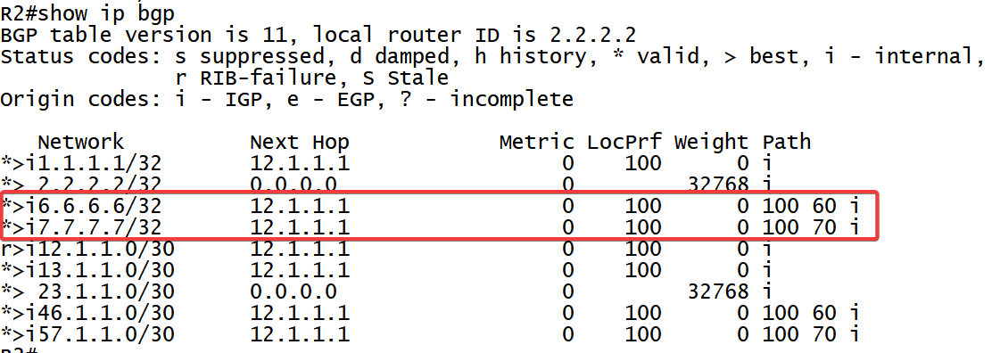

  从上可看出，其收到的路由都是来至于R1，并且通过ibgp传递过来，并且经过的AS号为100 60

- 在R3上查看export_out表项

  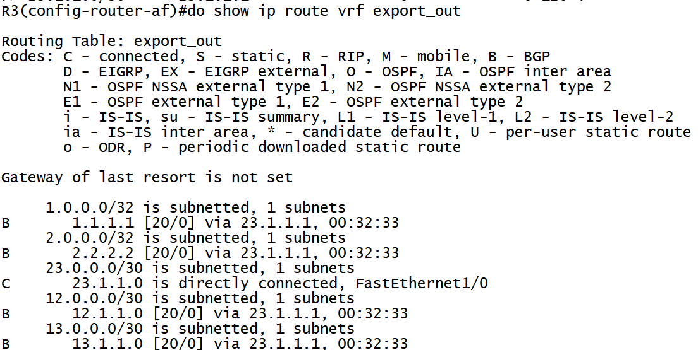

  从此可知，路由表中并没有R7及R6的路由，为什么R2从R1那儿收到了，没有传递给R3呢？因为BGP的防环机制，因为R7及R6的路由也是经过PE-R3传输给CE-R1的，其属性值带得有AS 100，因此在R2传递给R3时，查看到其带有自身AS号，拒绝将其加入路由表，那么此时我们在R6和R7上查看路由情况，会是怎么样呢？

- 分别查看R6和R7的路由

  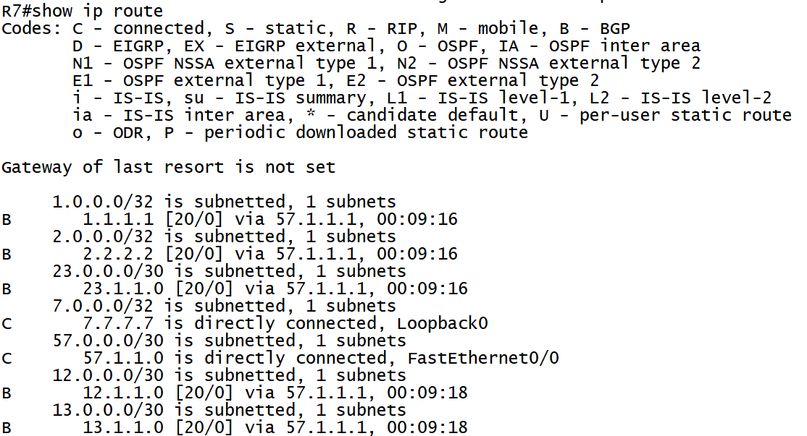

  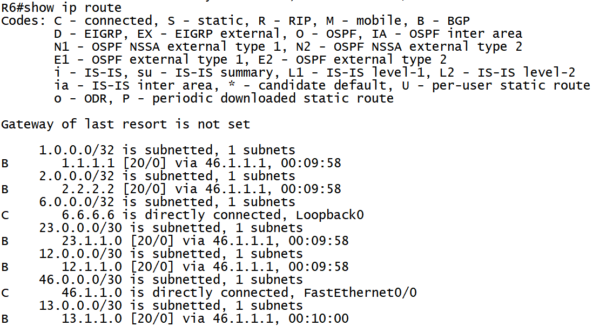

  从上可知R7上并没有收到R6的路由，R7也没有收到R6的路由，但都能收到R1和R2的路由，其原因是PE-R3上配置的VRF export_out的RT export 为100:12，而在上面提到的VRF export_out中恰好有这些路由表项，在PE-R4和PE-R5上设置的import为100:12，因此能将其加入路由表，传输给CE路由器； 

- 现在需要将PE-R3的VRF export_out中收到R6和R7的路由，上面已经提到原因了，因为BGP 的防环机制，所在需要在R3上配置允许AS号相同的路由进入，如下配置

  ```sh
  router bgp 100
  address-family ipv4 vrf export_out
  neighbor 23.1.1.1 allowas-in 3 //允许其自治系统号重复的次数
  ```

  

- 此时在R3上再次查看bgp路由

  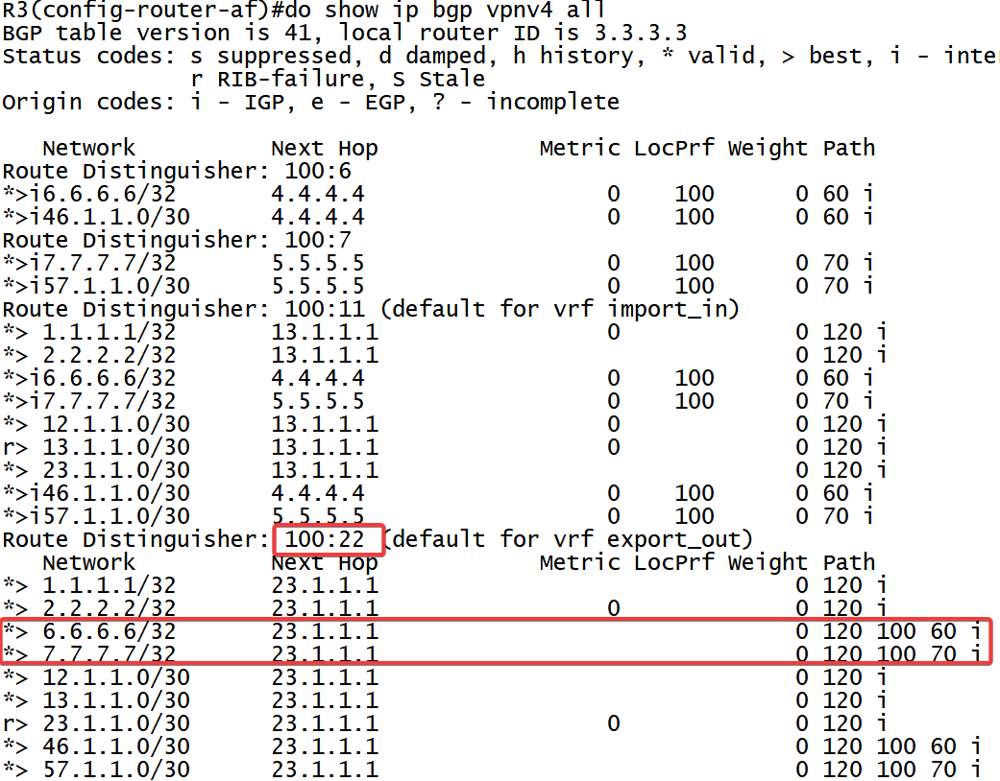

  由此可见，R6和R7上的路由已经加入export_out路由表中，并且其下一跳是23.1.1.1，由CE-R2通告过来的，其经过的路径为120 100 60、120 100 70

- 此时在R6和R7上查看公网路由

  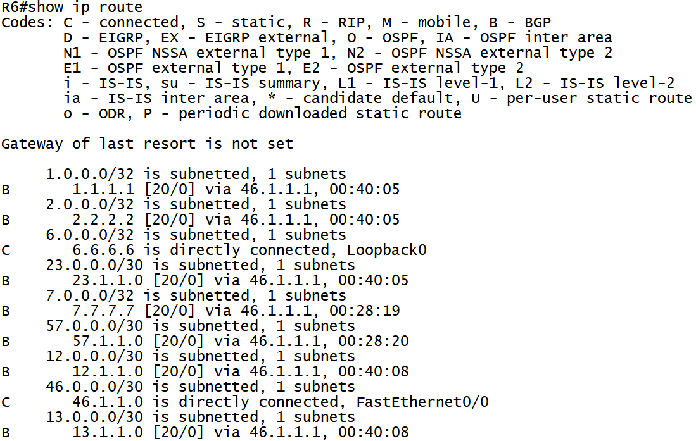

  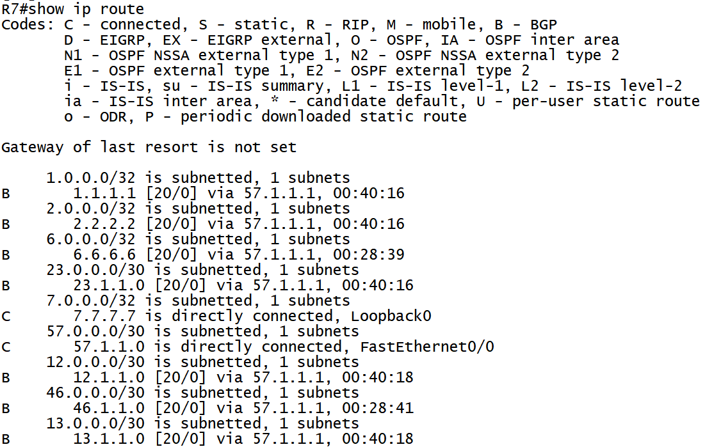

  由此可见，R6和R7上都有到对方的路由

- 此时在R6上traceroute R

  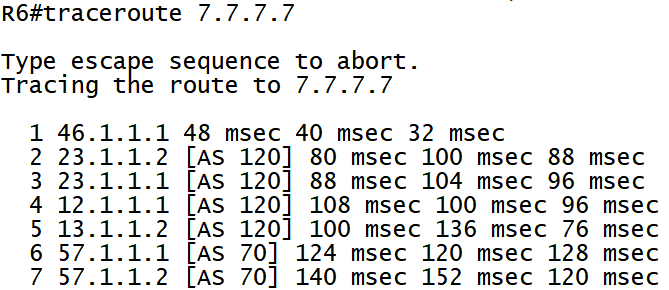

  从上可知，路径为：R6->R4->R3->R2->R1->R3->R5->R7
