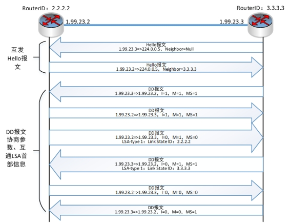
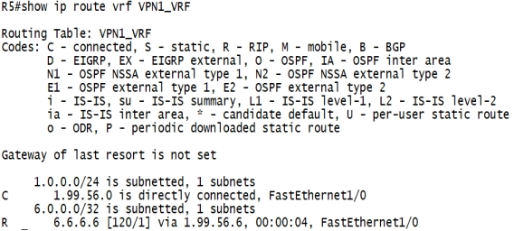

简介：使用MPLS网络实现单个VPN内站点之间的通信。

## 一、网络拓扑图：

在GNS3中添加路由器，搭建如下拓扑。

 

## 二、Ip地址配置：

### 1. IP地址配置规则：

（1）链路地址：班级号.学号.两端路由器号.路由器号/24，如R1的F0/0端口地址为：1.99.12.1/24，R2的F1/0端口IP地址为：1.99.12.2/24。

（2）Loopback地址：路由器号.路由器号.路由器号.路由器号，如R1的Loopback地址为：1.1.1.1/32。

（3）范例配置：1班99号的IP地址

表1 IP地址分配

|      | f0/0接口     | f1/0接口     | Loopback   |
| ---- | ------------ | ------------ | ---------- |
| R1   | 1.99.12.1/24 |              | 1.1.1.1/32 |
| R2   | 1.99.12.2/24 | 1.99.23.2/24 | 2.2.2.2/32 |
| R3   | 1.99.23.3/24 | 1.99.34.3/24 | 3.3.3.3/32 |
| R4   | 1.99.34.4/24 | 1.99.45.4/24 | 4.4.4.4/32 |
| R5   | 1.99.45.5/24 | 1.99.56.5/24 | 5.5.5.5/32 |
| R6   | 1.99.56.6/24 |              | 6.6.6.6/32 |

（4）配置完后，网络中的IP地址如下图所示

 

### 2. 配置命令：

R1:

```sh
#R1:
int f0/0
ip address 1.99.12.1 255.255.255.0
no shutdown
int lo0
ip address 1.1.1.1 255.255.255.255

#R2:
int f0/0
ip address 1.99.12.2 255.255.255.0
no shutdown
int f1/0
ip address 1.99.23.2 255.255.255.0
no shutdown
int lo0
ip address 2.2.2.2 255.255.255.255

#R3:
int f0/0
ip address 1.99.23.3 255.255.255.0
no shutdown
int f1/0
ip address 1.99.34.3 255.255.255.0
no shutdown
int lo0
ip address 3.3.3.3 255.255.255.255

#R4
int f0/0
ip address 1.99.34.4 255.255.255.0
no shutdown
int f1/0
ip address 1.99.45.4 255.255.255.0
no shutdown
int lo0
ip address 4.4.4.4 255.255.255.255

#R5
int f0/0
ip address 1.99.45.5 255.255.255.0
no shutdown
int f1/0
ip address 1.99.56.5 255.255.255.0
no shutdown
int lo0
ip address 5.5.5.5 255.255.255.255

#R6
int f0/0
ip address 1.99.56.6 255.255.255.0
no shutdown
int lo0
ip address 6.6.6.6 255.255.255.255
```


### 3. 查看配置是否正确：

（1）查看端口状态：

 

此时查看路由，可以发现各路由器只有本地直连路由及本地loopback路由。

也可以在配置模式下使用do show ip int b命令跨模式查看。

（2）查看相邻链路可达性

在R2和R3之间的链路上使用Wireshark软件抓包。

可以首先使用show arp命令查看一下地址解析表

在R2上执行ping 1.99.23.3命令。

 

！表示数据发送成功，可以看到第一个是"."，则表示数据发送失败，这是因为，第一个包在发送时，R1中并没有1.99.12.2的MAC地址，于是就去发送ARP请求来获得其MAC地址，但是当获得MAC地址之后，第一个包已经超时了（等待MAC地址超时），并没有发送出去。

（3）分析ARP过程

在WireShark中查看ARP包，分析ARP请求报文：

① 第二层地址：

l 源MAC：本地MAC地址

l 目的MAC：全F，广播地址

注意：查看这个ARP请求包的数据链路层的目的MAC地址：全F，是一个广播地址，这也就意味着，发送一个ARP请求包，以太网中的所有主机都能够收到该ARP请求包，但是并不是所有的主机都会回复这个ARP请求包。

② ARP请求报文：

l 发送端IP地址：1.99.23.2

l 目的Ip地址：1.99.23.3

l 发送方MAC地址：本机MAC地址

l 目的MAC地址：全0

分析：在ARP请求包中，会把目的以太网地址字段的值置为全0，因为此时并不知道目的以太网地址是什么。

以太网中只有当接收者的IP地址与ARP请求包中的Target IP address中标识的目的IP地址一致时才会进行回复。

 

分析该ARP响应报文：

 

① 第二层地址：

l 源MAC：本地MAC地址

l 目的MAC：R2的MAC地址

此响应报文发送的时单播包。

② ARP响应报文：

l 发送端IP地址：1.99.23.3

l 目的Ip地址：1.99.23.2

l 发送方MAC地址：本机MAC地址

l 目的MAC地址：R2的MAC地址

此时也可以查看ping发出的ICMP包，只有4对ICMP包，因为第一个包已经超时了。 

此处注意：不能再所有配置都完成后再查看ARP报文，当arp映射表已经形成后，链路上不会再发arp报文

## 三、域内路由协议配置

1. 配置命令

首先配置R2和R3路由器，配置命令如下：

```sh
#R2
router ospf 50
router-id 2.2.2.2
net 1.99.23.2 0.0.0.0 area 0
net 2.2.2.2 0.0.0.0 area 0

#R3
router ospf 50
router-id 2.2.2.2
net 1.99.23.2 0.0.0.0 area 0
net 2.2.2.2 0.0.0.0 area 0
```


2. 分析OSPF邻居建立过程

在R2和R3之间的链路上抓包，查看并分析OSPF邻居建立过程

配置完R2后，在Wireshark上查看，发现R2一直在广播Hello报文

 

配置完R3后，在Wireshark上查看链路上的OSPF报文

 

分析该邻居建立及OSPF数据库同步过程

 


 


同样配置R4和R5路由器

```sh
#R4
router ospf 50
router-id 4.4.4.4
net 1.99.34.4 0.0.0.0 area 0
net 1.99.45.4 0.0.0.0 area 0
net 4.4.4.4 0.0.0.0 area 0

#R5
router ospf 50
router-id 5.5.5.5
net 1.99.45.5 0.0.0.0 area 0
net 5.5.5.5 0.0.0.0 area 0
```

 

3. 查看配置是否正确

（1）使用show ip ospf nei命令查看OSPF邻居关系

 

表明邻居关系已经建立成功。

（2）使用show ip ospf data命令查看OSPF LS数据库

 

OSPF数据库中的链路状态分为两部分：路由器链路状态和网络链路状态

路由器R3发布的链路状态信息包括三条链路：3.3.3.3、1.99.34.3、1.99.23.3

（3）使用show ip route命令查看公网路由表

 

可以看到路由器R2中包含了域内各网络路由。

（4）使用ping命令查看域内各路由器之间是否互通

在R2路由器上ping R5，查看是否实现互通

 

## 四、域内MPLS配置

在R2、R3、R4和R5的对应接口配置MPLS，激活LDP。此步骤需注意边缘路由器的接口配置。

1. 配置命令

   ```sh
   #R2
   ip cef
   mpls ldp router-id lo0
   mpls label range 200 299
   int f1/0
   mpls ip
   
   #R3
   ip cef
   mpls ldp router-id lo0
   mpls label range 300 399
   int f0/0
   mpls ip
   int f1/0
   mpls ip
   
   #R4
   ip cef
   mpls ldp router-id lo0
   mpls label range 400 499
   int f0/0
   mpls ip
   int f1/0m
   pls ip
   
   #R5
   ip cef
   mpls ldp router-id lo0
   mpls label range 500 599
   int f0/0
   mpls ip
   ```

   

2. 分析LDP邻居建立过程

配置完R2后，可以看到链路上R2在不停发LDP Hello报文。

 

配置完R3后，可以看到LDP邻居建立过程。查看各数据包，分析LDP邻居建立过程：

 

由此可总结出LDP邻居建立过程：

 

查看Hello报文，可以看出，LDP的Hello报文由UDP协议封装

3. 查看配置是否正确

配置成功后，使用show命令查看。

（1）查看LDP邻居

 

可以看到R3路由器有两个LDP邻居：2.2.2.2、4.4.4.4

（2）查看标签映射表LIB、路由表RIB、标签转发表LFIB

 

图中的imp-null 是隐式空标签， 如果匹配到它，就要将标签弹出。

由此可以看出，R3上的标签映射表可以总结为下表：

| 目的IP    | 本地标签 | R2分配 的标签 | R4分配的标签 |
| --------- | -------- | ------------- | ------------ |
| 1.99.12.0 |          | POP           |              |
| 1.99.23.0 | POP      | POP           | 400          |
| 1.99.34.0 | POP      | 200           | POP          |
| 1.99.45.0 | 300      | 201           | POP          |
| 2.2.2.2   | 301      | POP           | 401          |
| 3.3.3.3   | POP      | 202           | 402          |
| 4.4.4.4   | 302      | 203           | POP          |
| 5.5.5.5   | 303      | 204           | 403          |

查看R3上的路由表：

 

该路由表可简化成下列格式：

| 目的子网  | 下一跳    |
| --------- | --------- |
| 1.99.23.0 | 直连      |
| 1.99.34.0 | 直连      |
| 1.99.45.0 | 1.99.34.4 |
| 2.2.2.2   | 1.99.23.2 |
| 3.3.3.3   | 直连      |
| 4.4.4.4   | 1.99.34.4 |
| 5.5.5.5   | 1.99.34.4 |

由此可以得出R3上的标签转发表应生成如下：


验证：查看R3上的标签转发表：

 

符合前面表格

（4）查看MPLS域内数据封装过程

在R2上traceroute R5，查看数据包的标签封装过程

 

（5）小结：MPLS网络中的数据传递过程：

 

看到，数据包在1.99.23.0链路上标签为303，在1.99.34.0链路上标签为403，在1.99.45.0链路上无标签，此为倒数第二跳弹栈技术。

## 五、PE上VRF配置

### 1. 配置命令

在R2(PE1)和R5(PE2)上配置VRF，把对应接口放入VRF中

配置命令如下：

```sh
#R2
ip vrf VPN1_VRF
rd 1:1
route-target export 2345:2
route-target import 2345:5
int f0/0
ip vrf for VPN1_VRF
ip addr 1.99.12.2 255.255.255.0

#R5
ip vrf VPN1_VRF
rd 1:1
route-target export 2345:5
route-target import 2345:2
int f1/0ip vrf for VPN1_VRF
ip addr 1.99.56.5 255.255.255.0
```


注意两个VRF中的RT值配置。

### 2. 查看配置是否正确

使用show命令查看VRF路由表和公网路由表，注意配置VRF前后公网路由表的变化。

（1）配置VRF前，查看公网路由：

 

注意此时公网路由中有1.99.12.0网段路由

（2）配置VRF后，查看公网路由：

 

注意：此时公网路由中无1.99.12.0网段

（3）配置VRF后，查看私网路由：

 

注意，此时1.99.12.0网段已放置到VPN1_VRF的私网路由中，此时，R2路由器内部维护两个路由表：私网路由和公网路由，且PE-CE间接口放置到公网中

（4）配置VRF后，查看VRF参数：


## 六、PE-CE之间路由配置

PE和CE之间可以使用任意路由协议，本例中在R1(CE1)-R2(PE1)之间使用OSPF协议，在R5(PE2)-R6(CE2)之间使用RIP协议

### 1. 配置CE1-PE1之间的OSPF协议

（1）配置命令如下：

```sh
#R1
router ospf 1
router-id 1.1.1.1
network 1.1.1.1 0.0.0.0 area 1
network 1.99.12.1 0.0.0.0 area 1

#R2
router ospf 1 vrf VPN1_VRF
network 1.99.12.2 0.0.0.0 area 1
```

 

（2）查看R2的VRF路由表，确定其中是否包含CE1上路由。（此步骤时间较长）

 

由上可见，此时VRF表中含有1.99.12.0和1.1.1.1两项路由，且此时1.1.1.1路由类型为O，说明此路由来自于OSPF协议。

### 2. 配置CE2-PE2之间的RIP协议

（1）配置命令如下

```sh
#R5
router rip
address-family ipv4 vrf VPN1_VRF
version 2
no auto-summary
network 1.99.56.5

#R5
router rip
version 2
no auto-summary
network 6.6.6.6
network 1.99.56.6
```


（2）查看R5中私网路由

 


由此可见，此时R5的VRF中包含两条路由：1.99.56.0和6.6.6.6，且路由6.6.6.6为RIP协议引入，配置成功。

## 七、配置MP-iBGP协议

### 1. 配置命令

在PE1和PE2上配置MP-iBGP协议，此步骤需一定时间

配置命令如下：

```sh
#R2
router bgp 2345
bgp router-id 2.2.2.2
no bgp default ipv4-unicast
neighbor 5.5.5.5 remote 2345
neighbor 5.5.5.5 update-source loopback 0
address-family vpnv4
neighbor 5.5.5.5 activate
neighbor 5.5.5.5 send-community extended
router ospf 1 vrf VPN1_VRF
redistribute bgp 2345 subnets
router bgp 2345
address-family ipv4 vrf VPN1_VRF
redistribute ospf 1 match internal external
no synchronization

#R5
router bgp 2345
bgp router-id 5.5.5.5
no bgp default ipv4-unicast
neighbor 2.2.2.2 remote 2345
neighbor 2.2.2.2 update-source loopback 0
address-family vpnv4
neighbor 2.2.2.2 activate
neighbor 2.2.2.2 send-community extended
router rip
address-family ipv4 vrf VPN1_VRF
redistribute bgp 2345 metric transparent
router bgp 2345
address-family ipv4 vrf VPN1_VRF
redistribute rip
exit-address-family
```


### 2. 查看配置是否正确

此时查看PE1上VRF路由

 

可以看出，此时PE1上的VRF表中已经获得CE2路由6.6.6.6

### 3. 结果分析

综合上述路由协议配置，可以得出MPLS VPN网络内的路由协议分布如下。

 

此时可以查看R2-R3链路上的BGP数据包，可以查到R2和R5之间互发的BGP更新报文中分别装载了目的网络、私网标签、RD值、RT值。

 

## 八、VPN客户端互通测试

### 1. 测试CE1和CE2之间的互通

 

此时两个客户端可以ping通

### 2. 使用traceroute命令，查看标签

在R1上使用traceroute命令，发现无法查看标签

 

在R1的f0/0接口开通MPLS，再使用traceroute命令，此时可以查看到标签。

 

分析私网数据在MPLS VPN结构中传递过程，在PE1封装了两个标签，栈底标签为506，栈顶标签为303，其中私网标签和前面BGP协议携带的私网标签一致，栈顶标签和R2中的标记信息库中的标签一致。

  图37 

此时还可以在沿途路由器上查看各路由器的标签转发表：

（1）在R2上查看标签压入情况

 

（2）在R3上查看LFIB

 

（3）在R4上查看LFIB

 

（4）最后在R5上使用show mpls forwarding-table vrf VPN1_VRF命令查看。

 

结果符合前面traceroute过程。
